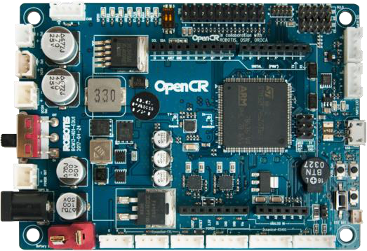

> Team Description Materials\
> Rapidly Manufactured Robot Challenge RoboCup Rescue 2023
>
> Felipe Catapano Emrich Melo, Rafael Eli Katri, Katy Terra, Enricco
> Gemha, Eduardo Mendes Vaz

March 2023
>
> **Abstract**
>
> The goal of the project presented in this material is the planning,
> construction and testing of a new, semi-autonomous robot suited for
> rescue operations. The robot must be able to traverse heavily uneven
> terrain, inspect the environment and manipulate objects to aid humans
> in dangerous or disaster-related scenarios, where the use of a human
> agent is undesirable or slow.
>
> It is a major technical overhaul of the project presented by the
> previous team, where more robust mechanical design, manufacturing
> methods, electronics employment and software techniques were used. The
> 2023 robot not only takes advantage of previously achieved innovations
> but has improvements in a wide range of aspects that proved to be
> crucial in many scenarios.
>
> **Introduction**
>
> The world is constantly evolving, with new and improved solutions
> emerging day by day. A decade ago, self-driving cars were just an
> idea, but now we have cars that are capable of autonomous driving. As
> humans, we are always striving to improve upon existing technology.
>
> Considering this, RoboCup was established to encourage students in the
> fields of robotics, technology, and AI development to create solutions
> that can benefit humanity.
>
> One category of the competition is the Rapidly Manufactured Robot
> Challenge, which challenges teams to build smaller and easier to
> produce robots than their Major rescue counterparts, that can assist
> humans in dangerous situations.
>
> Our team, Insper Dynamics, consisting of five members - Felipe,
> Rafael, Katy, Enrico and Eduardo, are all computer and mechanics
> engineering students from Brazil. With the help of Fabrício Barth, the
> advisor teacher of Insper Dynamics, the team was able to largely
> improve the previous year´s (RoboCup 2022 Thailand) system with the
> use of a simpler and more compact electronic system, aluminum and
> steel parts, flipper tracks, smart servo motors, a web
>
> interface and algorithm improvements. Our strategies and results are
> detailed in this paper.
>
> **Structure**
>
> **Overview**
>
> The new robot consists of three modular layers. The bottom layer
> contains

two aluminum compartment chassis connected by two bearings and a
pivoting,

machined shaft, as well as four individual flipping track mechanisms.
The middle

> layer is a box with adjustable height, and the top layer has a
> manipulator arm and sensors.

*Figure 1 Isometric view of the robot*

*Figure 2 Frontal view of the robot*

*Figure 3 Side view of the robot*

*Figure 4 Bottom vertical view of the robot*

*Figure 5 Top vertical view of the robot.*

> **Metal chassis**
>
> With the use of a laser or plasma cutter, two low-tolerance parts are
> extracted from raw material and bent to form housings for two driving
> DC motors with high torque, two Robotis Dynamixel smart servos, and a
> bearing holder. This solution is more robust than previous 3D-printed
> plastic designs, not only due to a better use of available space for
> mechanical resistance redundancy, but also
>
> because of the new material´s tenacity. It also includes a new
> protection wall against sand, gravel and other sediments that can be
> harmful to the system.

*Figure 6 Half assembly of a chassis compartment*

> The front and back compartments are free to twist around the axis of
> the

central bearings, to act as a passive suspension and allow the robot to
always

have at least four points of contact with the ground. This was already
achieved in

the previous project, however this time, a double bearing setup was used
with a

> custom machined shaft. Since a large portion of force is exerted on
> this central arrangement, this is required to prevent structural
> failure.
>
> 

*Figure 7 Machined shaft.*

*Figure 8 Demonstration of double-bearing passive suspension*

> **Flipper Tracks**
>
> Locomotion is achieved with the use of four custom-made tracks
> arranged

in a differential drive setup. Each track can be turned (e.g., "raised"
or "lowered")

to better accommodate for any terrain, prevent rollovers and overcome
higher

physical obstacles (such as hurdle pipes in the case of tests proposed
by

> RoboCup).
>
> This subsystem is composed of:\
> • A flexible, high grip, 40mm rubber track with inner teeth (design
> originally made for use in an industrial machine)\
> • 2 custom-designed aluminum cut crown wheels\
> • A custom-designed aluminum machined shaft for connecting crown
> wheels.
>
> • 2 custom-designed, aluminum cut track faces with bearings • 2
> custom-designed, aluminum cut gears\
> • A custom-designed 3D printed track face connector piece.
>
> • A Robocore Traktor 65mm support wheel with inner bearing
>
> For the mechanism to work, a primary actuator with high torque output

capability (in this case, a 12V-rated Pololu 37D Metal Gearmotor with
70:1

> internal gear reduction) is attached to the crown wheel via an axle,
> while a secondary actuator (Dynamixel XL430-W250-T) with precise
> position feedback control turns a gear connected to the same axis as
> the primary shaft. When the primary shaft turns, a bearing guarantees
> that only the crown and track will receive the mechanical
> transmission. The faces are held in place by the gears, and only turn
> when the Dynamixel turns.

*Figure 9 Track face with bearing.*

*Figure 10 Simplified flipper track (rubber not represented)*

*Figure 11 Dynamixel gear transmission assembly*

*Figure 12 Since each track can flip individually, many more obstacles
can be overcome*

> **Component Box**
>
> An intermediate layer in a robot is an essential component that serves
> as a platform for mounting the robot\'s sensors, drivers, and printed
> circuit board (PCB). This layer acts as a bridge between the robot\'s
> control unit and the sensors and actuators, allowing for easy
> communication and control of the robot\'s movements.
>
> One of the critical features of an intermediate layer is its ability
> to regulate the height of the robot. This allows the robot to operate
> in a variety of environments, including uneven terrain, without
> compromising its stability or accuracy. By adjusting the height, the
> robot can also adapt to different tasks, such as picking up objects of
> varying sizes or navigating through tight spaces.
>
> In addition to its role in height regulation, the intermediate layer
> also helps to protect the robot\'s sensitive electronic components
> from external factors such as dust, debris, and moisture. By housing
> these components in a secure and protected location, the robot is
> better equipped to operate in challenging conditions and withstand
> wear and tear over time.
>
> Overall, the intermediate layer plays a crucial role in the
> functioning of a robot, providing a stable platform for the robot\'s
> components while also enabling it to adapt to different environments
> and tasks.
>
> **OpenMANIPULATOR-X**
>
> OpenMANIPULATOR-X is an open-hardware arm manipulator developed by
> Robotis. The arm consists of a 5 function and 4 DOF manipulator with 4
> revolution joints and a gripper as an end-effector. OpenMANIPULATOR-X
> has 5 Dynamixel XM430-W350-T actuators, which are set in a daisy
> chain.
>
> The daisy chain configuration is a significant upgrade to last year\`s
> iteration. As all Dynamixel servos are connected in series, there is
> only one cable to connect to the OpenCR board. Therefore, the robot
> assembly is substantially easier, considering cables of different
> lengths would be otherwise necessary.
>
> 

*Figure 13 The OpenMANIPULATOR-X robot claw*

> The Dynamixel actuators have RAM and EEPROM control tables that are
> used to set position goals and get joint position, velocity, and
> effort data. To establish communication to the OpenCR, a TTL serial
> connector is connected from the daisy chain to the board and
> information is shared via the Dynamixel Protocol 2.0. To handle this
> exchange in a higher level, the Dynamixel Workbench library is used.
> This a remarkable upgrade, considering that the last iteration could
> only use current goals via PWM and there was a need to use extra
> components to regulate the voltage.
>
> **Electronics**

> **OpenCR**

*Figure 14 Robotis OpenCR Board*

> Electronics and decision-making play an integral role in the operation
> of robots. With advancements in technology, robots have become
> increasingly sophisticated, relying on a combination of hardware and
> software to execute tasks. In the past, robots were designed to carry
> out most of the processing on their own, with a computer used solely
> for commanding and monitoring the robot\'s actions. However, with the
> evolution of technology, this paradigm has shifted, with robots now
> requiring a more powerful computer to perform complex computations.
>
> One example of this shift is the use of the OpenCR board, which is
> like an Arduino board but specifically designed to support Dynamixel
> servos. The OpenCR board provides a powerful and flexible platform for
> controlling the servos, allowing for precise and reliable movements.
> By offloading the processing of the servos to the OpenCR board, the
> robot\'s main computer can focus on other tasks, such as sensor data
> processing, decision-making, and high-level control.
>
> Furthermore, the ability to make quick and accurate decisions is
> critical in robotics, particularly in situations where the robot needs
> to respond quickly to changes in the environment. With the OpenCR
> board, the robot can make decisions faster, reducing the delay between
> sensing and acting. The use of advanced algorithms, such as machine
> learning and artificial intelligence, can further enhance the robot\'s
> decision-making capabilities, enabling it to adapt to changing
> conditions and learn from experience.
>
> In summary, the integration of electronics and decision-making plays a
> crucial role in the operation of robots. The use of specialized
> hardware, such as the OpenCR board, and advanced algorithms, allows
> robots to make decisions quickly and accurately, increasing their
> ability to perform complex tasks. As technology continues to evolve,
> we can expect to see even more sophisticated robots, capable of
> performing tasks that were once thought impossible.
>
> **DC Motor Drivers**

*Figure 15 VNH2SP30 Dual Motor Shield*

> To drive the DC motors in the robot, two VNH2SP30 Dual Drivers are
> used.
>
> They are the same drivers used in the previous project.
>
> Since cheap drivers are not energetically efficient, we use this
> driver that can control 2 DC motors, with a maximum current draw of
> 30A for each channel.
>
> This motor drive uses the following ports to control the motors: -
> Digital 4: InputB from motor 1\
> - Digital 5: PWM from motor 1\
> - Digital 6: PWM from motor 2\
> - Digital 7: InputA from motor 1\
> - Digital 8: InputA from motor 2\
> - Digital 9: InputB from motor 2\
> - Analogic 0: Enable from motor 1\
> - Analogic 1: Enable from motor 2
>
> The logic for VNH2SP30 usage is the same as for L298n drivers, the
> only
>
> difference being the enable pins, which need to be driven HIGH to
> work.
>
> **PCB**
>
> Printed circuit boards (PCBs) are critical components in the design
> and manufacturing of electronic devices, including robots. The latest
> version of our PCB has been specifically designed to support the
> OpenCR driver, which is a
>
> powerful and flexible platform for controlling Dynamixel servos. This
> integration allows for precise and reliable movement control, ensuring
> that your robot can execute tasks with accuracy and consistency.
>
> In addition to supporting the OpenCR driver, we also removed the
> step-down circuit from the latest version of the PCB.
>
> It is important to note that while the actual version of our PCB is
> very similar to the latest version, the addition of support for the
> OpenCR driver and the removal of the step-down circuit represent
> significant changes that can impact the robot\'s performance and
> functionality.

*Figure 16 Both sides of PCB*

*Figure 17 Dimensions of PCB*

> **Lidar Scanner**
>
> Lidar LDS01, also known as the Hokuyo URG-04LX-UG01, is a popular
> laser rangefinder sensor used in robotics. Its widespread use can be
> attributed to its ease of use and programmability. The sensor is
> commonly used in robots such as the TurtleBot, where it serves as a
> key component for obstacle avoidance and navigation.
>
> One of the main advantages of Lidar LDS01 is its plug-and-play
> functionality. The sensor comes with a USB interface that can be
> easily connected to a computer or a microcontroller. Additionally,
> there is no need for any additional drivers or software installation,
> which makes it a hassle-free solution for beginners and professionals
> alike. The sensor can be programmed using various programming
> languages such as Python and C++, making it a versatile choice for
> different projects.
>
> The Lidar LDS01 sensor provides accurate and reliable distance
> measurements, with a range of up to 4 meters and a resolution of 1mm.
> It has a scanning frequency of 10 Hz, making it suitable for real-time
> applications. The sensor is also lightweight and compact, which makes
> it easy to mount on robots or mobile platforms.
>
> One of the notable applications of Lidar LDS01 is in the field of
> autonomous navigation. With its high accuracy and resolution, the
> sensor can be used to create 2D maps of the environment, which can
> then be used by the robot for path planning and obstacle avoidance.
> The sensor\'s scanning frequency and range make it suitable for both
> indoor and outdoor applications.
>
> In conclusion, Lidar LDS01 is a reliable and easy-to-use sensor that
> has become a popular choice for robotics applications. Its
> plug-and-play functionality, programmability, and accuracy make it an
> excellent option for both beginners and professionals. The sensor\'s
> compact size and light weight make it easy to integrate into different
> robotic platforms, and its high scanning frequency and range make it
> ideal for real-time applications. With its numerous benefits, Lidar
> LDS01 is undoubtedly an excellent choice for anyone looking for a
> dependable and versatile laser rangefinder sensor for their robotics
> projects.
>
> **Cameras**
>
> Cameras are a crucial component in our robot, enabling us to perceive
> and interact with our environment. We are using high-resolution
> generic cameras to capture images and video of the environment. These
> cameras are mounted on our robot arm and equipped with fisheye lenses
> to capture a wider field of view.
>
> The cameras we are using have a high resolution, allowing for detailed
> and accurate image capture. This is particularly important in robotics
> applications where visual perception is critical, such as object
> recognition, navigation, and
>
> mapping. The high-resolution cameras also allow for better accuracy
> and precision in the manipulation and control of objects in the
> environment.
>
> By mounting the cameras on our robot arm, we can capture images from
> different angles and positions, providing a more comprehensive view of
> the environment. This is particularly useful in applications such as
> object recognition and tracking, where the ability to capture images
> from multiple angles can improve the accuracy and robustness of the
> system.
>
> The fisheye lenses we are using provide a wide-angle view of the
> environment, enabling our robot to capture a broader field of view.
> This is particularly useful in applications where our robot needs to
> navigate in complex and dynamic environments. The fisheye lenses also
> allow for the capture of 360-degree panoramic images, which can be
> useful for mapping and visualization applications.
>
> **Thermal Imager**

*Figure 18 AMG8833 8x8 Thermal Imager Module*

> The thermal imager that we are using is the AMG8831, that has support

for Arduino, raspberry and any other device that can communicate over
I2C. This

electronic module has and high efficiency and is based on Infrared heat
detection

sensor that allows the user to detect movement in dark environments, for

> example.
>
> This sensor has a matrix of 8x8 thermal sensors and returns a matrix
> of 64

temperature individual readings. In the previous year, the team has
studied the

possibility of acquiring a new camera with a higher resolution, which in
a real

rescue scenario would provide better readings for the operator. Since
this factor

is not considered in RoboCup, however, the team decided to remain with
the 8x8

> camera to reduce costs of the project.

  -----------------------------------------------------------------------------------
  You     can     learn   more    about   the     specific   module   used    at:
  ------- ------- ------- ------- ------- ------- ---------- -------- ------- -------

  -----------------------------------------------------------------------------------

> **CO2 Measurement Sensor**

*Figure 19 CCS811 Sensor*

> The CCS811 is a low power miniature digital gas sensor for monitoring
> air quality. A metal oxide sensor is integrated to measure the total
> volatile organic compounds equivalent of TVOCs, making it possible to
> monitor air quality when working in conjunction with microcontrollers,
> only requiring I2C serial communication.
>
> The module is based on unique microplate technology, meaning the plate
> presents a highly reliable solution for projects that require gas
> sensor, fast cycle times and a significant reduction in average power
> consumption. The integrated MCU manages the sensor trigger modes and
> the measured data. The CCS811 supports intelligent algorithms to
> process measurements and output an equivalent TVOC value, as well as
> supporting multiple measurement modes that are optimized for low power
> consumption, thus extending battery life in portable devices.
>
> He also requires 3,3 V of power and comes from Arduino. His pins from
> CLOCK and DATA (SCL and SDA) are connected in series with the same
> pins from the thermal camera, and them connected on Arduino's I2C
> pins.
>
> Learn more at: https://www.sparkfun.com/products/14193 .
>
> **Software**
>
> **ROS**
>
> ROS (Robot Operating System) is an open-source software framework used
> to develop and control robotic systems. It provides a collection of
> tools, libraries, and conventions for creating complex and robust
> robot applications. ROS offers a distributed computing environment
> that allows multiple processes to run simultaneously on different
> machines and communicate with each other through messages. It also
> includes various components such as drivers that enable developers to
> easily integrate and control hardware components.

> *Figure 20 ROS Noetic*\
> For this year\'s iteration ROS Noetic, the latest long term support
> ROS 1 distro, was chosen. The main changes from this version include
> Python 3 support and performance improvements of real-time operations
> and memory management. The framework is used in the project primarily
> for communicating data between the master and slave processes. In
> addition, ROS packages such as *"hector slam"* and *"gmapping"* are
> used for autonomous navigation and *"hls_lfcd_lds_driver"* is a ROS
> wrapper that controls the LDS-01 lidar.
>
> Another major difference is that the master process, responsible for
> the machine vision algorithms, handling controller input and sharing
> sensor data to the interface, runs on an external computer. This
> implies in a more reliable power supply to the master process, which
> is also safe from wall collisions.
>
> With the use of roslibjs, a JavaScript library that allows interaction
> with ROS data via browser, a new user interface was developed, in
> contrast to last
>
> year\`s version, that was part of the main software executable, this
> interface is self-dependent. The communication is based on WebSockets
> and the *"rosbridge"*package.
>
> **MoveIt**
>
> MoveIt is an open-source software framework for motion planning and
> manipulation of articulated robots, including robot arms and grippers.
> It provides a set of tools, libraries, and APIs that enable developers
> to plan, execute, and visualize robot motions in real-time. MoveIt
> includes various algorithms for motion planning, collision detection,
> trajectory generation, and kinematics.
>
> Robotis, the company that developed the Open-Manipulator-X robot arm,
> has a ROS environment that allows to create trajectories and control
> the arm\`s actuators. Nevertheless, this method proved to be
> unreliable as the program consistently freezes and miscalculate
> trajectories. The out-of-the box experience for Open-Manipulator-X was
> lacking, so MoveIt was chosen as a more robust and complete
> alternative.
>
> The framework\`s *"move_group"* API is used to plan
> Open-Manipulator\`s trajectory. The API uses ROS topics as endpoints
> to get goals on task or joint space and calculates the trajectory
> using forward and inverse kinematic equations. Description files as
> URDF and SRDF, that describe the claw\`s dimensions and information
> relative to joints and mechanical behavior, are used to setup MoveIt
> configuration and the *"move_group"* API.
>
> The actuators are controlled on the slave process and joint position
> data is constantly updated by the OpenCR and shared via ROS to the
> joint state topic, which is subscribed by the *"move_group"* API. The
> low-level controller has a layer of abstraction to integrate to
> MoveIt, using ROS topics.
>
> **React Interface**

*Figure 20 New robot interface*

> On the front-end, the interface was designed using the application, as
> seen in Figure 20, so that it followed a fixed UI/UX pattern and
> provided the best usability experience for the robot pilot. The idea
> was to bring all the information (camera image, sensor data, \...)
> directly to the point and make the buttons as intuitive as possible,
> such as with their color in red when a certain robot mode is inactive,
> and green when active. The images that can be seen in Figure 20 on the
> interface are placeholders used when the robot is not connected, still
> maintaining the previously established layout pattern. a JavaScript
> framework, was used to create the interface.
>
> On the back-end (if it can be called that, because we did not use a
> database), the library was used in JavaScript, which is part of the
> ROS ecosystem (via a websocket called ), so that the buttons can
> publish information on their respective topics, and the camera images
> and sensor information can be obtained by subscribing to the desired
> topic. For this communication to have a real-time factor, the use of
> React was very important, as any change of state in the topics
> reflects an immediate change in the visual
>
> feedback of the interface, without any delay or bottleneck. To better
> understand what the publishers and subscribers are, see Figure 21 and
> 22.
>
> 

*Figure 21 Interface Publisher Topics*

> 

*Figure 22 Interface Subscriber Topics*

> **YOLOv5**
>
> In order to enable the robot to quickly and reliably detect Hazmat
> Labels,

a new custom object recognition model was created. This time, utilizing
a larger

> labeled image dataset and a faster implementation of the YOLO
> real-time object detection algorithm (v5 compared to previously used
> v3).
>
> The algorithm uses features learned from a deep convolutional neural
> network in a supervised training process. Because of the grid-based
> probabilistic approach, multi-class detection with vector
> generalization is achieved, and all kinds of hazmat signs can be
> detected regardless of translation or rotation in the image, or any
> external factors such as brightness, saturation, background, etc. Such
> factors contributed for the popularization of this algorithm, which
> is, as of right now, considered a state-of-the-art approach to solving
> object recognition problems.
>
> 

*Figure 23 Hazmat dataset label statistics*

> 

*Figure 24 YOLOv5 model confusion matrix*

> 

*Figure 25 YOLOv5 model training results*

*Figure 26 YOLOv5 model prediction example*

> It is worth stating, however, that QR Detection on the robot is not
> achieved via the use of a YOLO model. For this specific task, the ZBar
> C++ library is used. This algorithm has very similar performance
> characteristics and has been proven by the team to be capable of
> reliably detecting and decoding QR Codes in real-time, through
> extensive testing in a variety of situations.
>
> **SLAM and Autonomous Navigation**
>
> Simultaneous Localization and Mapping (SLAM) is a task that consists
> of tracking an agent location in a procedurally generated map, which
> is created by the agent\`s sensors. In this year\`s iteration, the
> *"hector slam"* ROS package gathers the LDS-01 laser scan data and
> generates a two-dimensional occupancy grid to map the robot\`s
> surroundings.

*Figure 27 Occupancy Grid example*

> The autonomous navigation algorithm passed through major changes to be
> optimized to small areas. Tailored with the preliminaries and
> best-in-class phases in mind, the algorithm consists of collecting
> laser scan data to identify the distances of the robot to the walls
> and ensuring it is centralized on the course. This stems from previous
> experiences, in which frontier exploration and more complex path
> planning algorithms were not efficient on small areas with known
> shape. Even though its principle is rather simple, the autonomous
> algorithm is faster and more reliable than its predecessor.